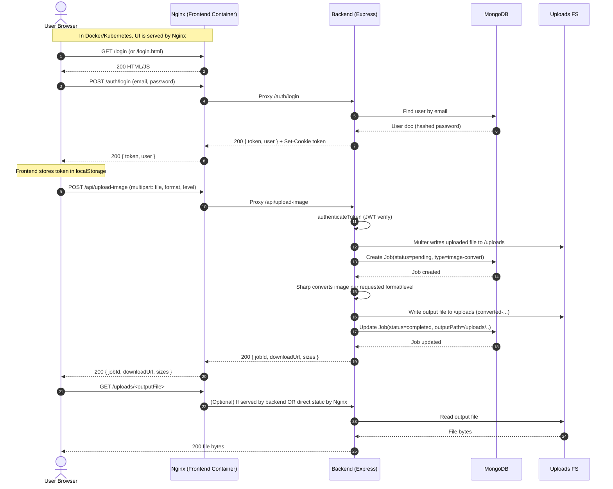

# Compressorr — Detailed Application + Deployment Guide (Repository-Based)

This document is an **exhaustive, repo-based** walkthrough of:
- how the application works end-to-end (frontend → backend → database → storage → metrics), and
- how it is deployed using Docker Compose, Kubernetes (EKS-style manifests), Jenkins CI/CD, SonarQube, and Prometheus/Grafana,
- plus how the included Ansible playbooks automate provisioning.

> Note: This file is intentionally **separate from README.md**. It does **not** replace or modify README.md.

---

## Table of Contents

1. [Repository Map](#1-repository-map)
2. [Runtime Architecture (What Runs Where)](#2-runtime-architecture-what-runs-where)
3. [Backend Deep Dive](#3-backend-deep-dive)
   - [3.1 Process & Startup](#31-process--startup)
   - [3.2 Static Hosting Model](#32-static-hosting-model)
   - [3.3 Authentication (JWT + Cookies + OAuth)](#33-authentication-jwt--cookies--oauth)
   - [3.4 API Endpoints (Full Map)](#34-api-endpoints-full-map)
   - [3.5 File Upload + Conversion/Compression Pipeline](#35-file-upload--conversioncompression-pipeline)
   - [3.6 Data Model](#36-data-model)
   - [3.7 Metrics (Prometheus)](#37-metrics-prometheus)
   - [3.8 CORS and Browser Session Behavior](#38-cors-and-browser-session-behavior)
   - [3.9 Local Storage, Uploads, and Persistence](#39-local-storage-uploads-and-persistence)
4. [Frontend Deep Dive](#4-frontend-deep-dive)
5. [Docker (Images + Compose)](#5-docker-images--compose)
   - [5.1 Backend Image](#51-backend-image)
   - [5.2 Frontend Image(s)](#52-frontend-images)
   - [5.3 Docker Compose Runtime](#53-docker-compose-runtime)
   - [5.4 Docker Compose Step-by-Step](#54-docker-compose-step-by-step)
6. [Kubernetes Deployment (EKS-Style Manifests)](#6-kubernetes-deployment-eks-style-manifests)
   - [6.1 Namespace](#61-namespace)
   - [6.2 MongoDB (StatefulSet + Headless Service + Secret)](#62-mongodb-statefulset--headless-service--secret)
   - [6.3 Backend (Deployment + Service + Secret)](#63-backend-deployment--service--secret)
   - [6.4 Frontend (Deployment + LoadBalancer Service)](#64-frontend-deployment--loadbalancer-service)
   - [6.5 Monitoring in Kubernetes (Prometheus + Grafana)](#65-monitoring-in-kubernetes-prometheus--grafana)
   - [6.6 Operational Notes (Scaling, Health, Storage)](#66-operational-notes-scaling-health-storage)
   - [6.7 Kubernetes Step-by-Step](#67-kubernetes-step-by-step)
7. [CI/CD with Jenkins + SonarQube](#7-cicd-with-jenkins--sonarqube)
   - [7.1 Jenkins Setup Checklist](#71-jenkins-setup-checklist)
8. [Ansible Automation](#8-ansible-automation)
   - [8.1 Running the Ansible Playbooks](#81-running-the-ansible-playbooks)
9. [Terraform Inputs (Repo Example)](#9-terraform-inputs-repo-example)
10. [Environment Variables & Secrets Reference](#10-environment-variables--secrets-reference)
11. [Ports, URLs, and Network Map](#11-ports-urls-and-network-map)
12. [Known Inconsistencies / Gotchas](#12-known-inconsistencies--gotchas)
13. [Troubleshooting Checklist](#13-troubleshooting-checklist)
14. [Request Flow Diagram (Sequence)](#14-request-flow-diagram-sequence)
15. [Deployment Diagrams](#15-deployment-diagrams)

---

## 1) Repository Map

Top-level items and why they exist:

- `backend/`
  - `src/server.js`: Express app entrypoint, serves both API and frontend static files.
  - `src/routes/`: API routing:
    - `api.js`: protected file-processing + profile/settings + admin router.
    - `auth.js`: signup/login/JWT cookies + `/auth/me` + Google OAuth flow.
    - `admin.js`: admin-only routes for stats and user management.
  - `src/controllers/fileController.js`: the primary request handlers for file operations + jobs + profile/settings.
  - `src/services/conversionService.js`: Sharp/pdf-lib processing implementation.
  - `src/models/User.js`: MongoDB user schema.
  - `src/middleware/auth.js`: JWT verification + token creation.
  - `src/metrics.js`: Prometheus metric registry + counter.
  - `scripts/create-admin.js`: CLI script to create an admin user.

- `frontend/`
  - Static site: multiple pages (`*.html`) and scripts (`*.js`) that call `/auth/*` and `/api/*`.
  - `nginx.conf`: Kubernetes-oriented Nginx reverse proxy config (points to k8s backend service).
  - `nginx-docker.conf`: Docker Compose-oriented Nginx reverse proxy config (points to compose backend service).

- `Dockerfiles/`
  - `backend.Dockerfile`: backend container image.
  - `frontend.Dockerfile`: frontend Nginx static site image (k8s variant config).
  - `frontend-docker-compose.Dockerfile`: frontend Nginx image for Docker Compose.
  - `nginx.conf`: generic Nginx config (static caching) used by one of the build paths.

- `docker-compose.yml`: local/VM-style deployment bringing up MongoDB + backend + frontend.

- `k8s/`
  - Kubernetes manifests for:
    - `mongo/` (StatefulSet + Secret + Service)
    - `backend/` (Deployment + Secret + Service)
    - `frontend/` (Deployment + Service)
    - `monitoring/` (Prometheus + Grafana)

- `ansible/`
  - `inventory/hosts.ini`: inventory groups for EC2 instances.
  - `playbooks/`: provisioning + deployment automation.

- `Jenkinsfile`: CI/CD pipeline that builds/pushes images and applies k8s manifests.
- `sonar-project.properties`: SonarQube scanner configuration.
- `monitoring/prometheus.yml`: Prometheus scrape config for non-k8s (VM) monitoring scenario.
- `terraform.tfvars.example`: example Terraform variable inputs (the full Terraform module is not included in this repo snapshot).

---

## 2) Runtime Architecture (What Runs Where)

Compressorr supports **multiple runtime topologies**, depending on how you deploy.

### 2.1 Single-process (Backend serves Frontend)

In `backend/src/server.js`, Express is configured to serve:
- `express.static(<repo>/frontend)` for the UI
- `/api/*` and `/auth/*` for backend endpoints

This means **one Node process** can serve both UI and API (useful for local dev).

### 2.2 Split-process (Frontend Nginx → Backend API)

In Docker and Kubernetes, the repo also uses a separate frontend container:
- `frontend` container: Nginx serves static files and proxies `/api/`, `/auth/`, and `/socket.io/` to the backend service.
- `backend` container: Express API (and still *can* serve frontend, but in this mode frontend is typically served by Nginx).

This split approach is common for production because:
- caching and gzip are handled at the edge (Nginx)
- backend can scale independently

### 2.3 Data + storage components

- **MongoDB**: user accounts, job records, and user settings.
- **Filesystem uploads**: converted/compressed outputs are written to disk under `/uploads` (container path). In k8s, this is ephemeral unless you add a PV/PVC.

### 2.4 Observability components

- Backend exposes Prometheus metrics at `GET /metrics`.
- In VM mode: Prometheus and Grafana run on a monitoring host and scrape the backend.
- In k8s mode: Prometheus and Grafana are deployed into the `media-app` namespace.

---

## 3) Backend Deep Dive

### 3.1 Process & Startup

Entry: `backend/src/server.js`

High-level startup sequence:

1. **Create Express app**
2. **CORS**
   - builds an `allowedOrigins` set containing:
     - `http://localhost:5000`
     - `http://127.0.0.1:5000`
     - `http://localhost:8080`
     - `http://127.0.0.1:8080`
     - `process.env.FRONTEND_URL` (if provided)
   - In dev it effectively allows all origins.
3. **Body parsers + cookies + request logging**
   - `express.json()`, `express.urlencoded()`, `cookie-parser`, `morgan('dev')`
4. **Session + Passport**
   - `express-session` is enabled primarily for Google OAuth.
5. **Ensure upload directories exist**
   - `/app/uploads` and `/app/uploads/profiles` inside container
6. **Static hosting**
   - `/uploads/*` served from uploads folder
   - `/` served from frontend folder
7. **Route registration**
   - `/auth` → auth router
   - `/api` → api router
8. **Metrics**
   - `/metrics` returns Prometheus registry
9. **MongoDB connection attempt**
   - tries `process.env.MONGO_URI` else `mongodb://localhost:27017/filetool`
   - if connect fails, logs warning and still starts server (DB features will fail at runtime)
10. **Start HTTP server + attach Socket.IO**
    - currently logs when an "Admin" connects/disconnects

### 3.2 Static Hosting Model

Backend serves two kinds of static content:

1. **Uploads**
   - URL path: `/uploads/<filename>`
   - Backed by: `<repo>/uploads` (mapped to `/app/uploads` in containers)

2. **Frontend**
   - `express.static(<repo>/frontend)`
   - Clean routes are mapped for page names (e.g., `/dashboard` → `dashboard.html`).

In deployments where Nginx serves the frontend, Nginx proxies `/api` and `/auth` to the backend.

### 3.3 Authentication (JWT + Cookies + OAuth)

Backend auth is in `backend/src/routes/auth.js` and `backend/src/middleware/auth.js`.

#### 3.3.1 Token format
- JWT payload: `{ userId }`
- Token lifetime: `7d`

#### 3.3.2 Token transport
Tokens are accepted from:
- `Cookie: token=<jwt>` (set by backend)
- `Authorization: Bearer <jwt>` (used by frontend JS)

#### 3.3.3 Signup
`POST /auth/signup`
- Validates:
  - username length >= 3
  - email is valid
  - password length >= 6
- Creates user in MongoDB
- Issues JWT
- Sets `token` cookie with:
  - `httpOnly: true`
  - `sameSite: 'lax'`
  - `secure: NODE_ENV === 'production'`

#### 3.3.4 Login
`POST /auth/login`
- Validates email+password
- Checks password via `User.comparePassword()`
- Issues JWT + cookie (same pattern as signup)

#### 3.3.5 Current user
`GET /auth/me`
- reads token from cookie or Authorization header
- verifies token and returns user without password

#### 3.3.6 Logout
`POST /auth/logout`
- clears token cookie

#### 3.3.7 Google OAuth
- `GET /auth/google` starts OAuth
- `GET /auth/google/callback` completes OAuth and redirects to frontend with `?token=...`
- Passport strategy lives in `backend/src/config/passport.js`.

OAuth configuration uses env vars:
- `GOOGLE_CLIENT_ID`
- `GOOGLE_CLIENT_SECRET`
- `GOOGLE_CALLBACK_URL`

### 3.4 API Endpoints (Full Map)

API router: `backend/src/routes/api.js`

Base prefix: `/api`

#### 3.4.1 Health
- `GET /api/health`
  - returns `{ status: 'ok' }`
  - used by Docker health checks

#### 3.4.2 File Operations (all require JWT)
All of these require `authenticateToken`:

- `POST /api/upload-image`
  - Upload field: `file` (multipart/form-data)
  - Body fields:
    - `format` (default `jpeg`)
    - `level` (default `maximum`)
  - Behavior: converts image to requested format

- `POST /api/compress-image`
  - Upload field: `file`
  - Body fields:
    - `level` (default `medium`)
  - Behavior: compresses image, generally keeping format (PNG may become WebP for some levels)

- `POST /api/restore-image`
  - Upload field: `file`
  - Body fields:
    - `level` (default `restore`)
  - Behavior: upscales/sharpens/enhances and outputs high quality

- `POST /api/upload-pdf`
  - Upload field: `file`
  - Body fields:
    - `level` (default `medium`)
  - Behavior: re-saves PDF with object streams options

#### 3.4.3 Job Tracking (all require JWT)
- `GET /api/jobs/:id`
  - returns one job, scoped to current user

- `GET /api/my-jobs`
  - returns up to 50 jobs for the current user

#### 3.4.4 Profile Management (all require JWT)
- `PUT /api/profile` (update username/email)
- `PUT /api/profile/password` (change password)
- `POST /api/profile/picture` (upload profile picture)
- `POST /api/profile/disconnect-google` (unlink Google account)
- `DELETE /api/profile` (delete account)
- `DELETE /api/clear-history` (delete all jobs)

#### 3.4.5 User Settings & Data (all require JWT)
- `PUT /api/user/settings` (save settings)
- `GET /api/user/settings` (load settings)
- `GET /api/user/export` (download JSON export)
- `DELETE /api/user/account` (delete account) — implemented by mapping to the same controller logic used by profile deletion

#### 3.4.6 Admin API (JWT + admin role)
Mounted at: `/api/admin/*`

Admin middleware: `isAdmin` checks `User.role === 'admin'`.

- `GET /api/admin/users`
- `GET /api/admin/stats`
- `GET /api/admin/activity`
- `PUT /api/admin/users/:id` (ban/unban flag)
- `DELETE /api/admin/users/:id`

### 3.5 File Upload + Conversion/Compression Pipeline

Upload handling:
- Multer is configured with disk storage.
- General uploads:
  - destination: `/app/uploads`
  - limit: 50MB
- Profile pictures:
  - destination: `/app/uploads/profiles`
  - limit: 5MB
  - only accepts `image/*`

Naming strategy:
- Incoming uploads: `Date.now() + randomSuffix + originalName`
- Output files:
  - `converted-<timestamp>-<originalBase>.<ext>`
  - `compressed-<timestamp>-<originalBase>.<ext>`
  - `restored-<timestamp>-<originalBase>.<ext>`

Processing implementation:
- Images: `sharp`
- PDFs: `pdf-lib`

Compression levels (`backend/src/services/conversionService.js`):
- `low`, `medium`, `high`, `maximum` with different quality and resize targets
- For PNG compression at low/medium, the service may convert PNG to WebP to achieve larger reductions.

Size estimation:
- For compression, backend estimates compressed size before processing via `estimateCompressedSize()`.

### 3.6 Data Model

#### 3.6.1 User model
File: `backend/src/models/User.js`

Fields:
- `username` (unique, min length 3)
- `email` (unique)
- `password` (required unless `googleId` exists)
- `googleId` (unique, sparse)
- `profilePicture`
- `role` in `{user, admin}`
- `settings`:
  - `defaultQuality` in `{high, medium, low}`
  - `autoDownload`, `keepOriginal`, `emailNotifications`, `compressionAlerts`
- `createdAt`
- `jobs` (references Job ids)

Password hashing:
- `pre('save')` hook hashes password with bcrypt.

#### 3.6.2 Job model
Job schema is created inline in `backend/src/controllers/fileController.js`.

Fields:
- `jobId` (UUID)
- `userId` (ref User)
- `type` (e.g., `image-convert`, `image-compress`, `image-restore`, `pdf`)
- `status` (`pending` default, later set to `completed`)
- `inputName`, `outputName`, `outputPath`
- `originalSize`, `compressedSize`
- `createdAt`

### 3.7 Metrics (Prometheus)

File: `backend/src/metrics.js`

Exposed endpoint:
- `GET /metrics`

Metrics:
- default process metrics via `collectDefaultMetrics`
- custom counter: `filetool_jobs_total{type,status}`

Important note:
- The current controller code does not increment `jobsCounter` in the shown snippets. If you want job counters to reflect actual work, you typically increment:
  - when a job is created (pending)
  - and/or when completed/failed

### 3.8 CORS and Browser Session Behavior

Backend CORS:
- `credentials: true` is enabled, so cookies can be used.
- In dev, the code returns `callback(null, true)` for most origins.

Cookies:
- `token` cookie is set as httpOnly.
- Frontend also stores the JWT in `localStorage` and sends `Authorization: Bearer <token>`.

### 3.9 Local Storage, Uploads, and Persistence

Uploads are stored on disk:
- Local machine: `uploads/` under repository root.
- Docker Compose: host `./backend/uploads` is mounted to container `/app/uploads`.

Kubernetes:
- default manifests do **not** define a PersistentVolume for uploads.
- This means uploads will be lost when pods restart.

Production options (recommended patterns):
1. Add a PVC and mount it at `/app/uploads`.
2. Move artifact storage to object storage (S3) and store only URLs/metadata in Mongo.

---

## 4) Frontend Deep Dive

The frontend is a multi-page static web app (HTML/CSS/JS). It expects to call backend endpoints on the **same origin** via paths like `/auth/login` or `/api/upload-image`.

How this works:
- In **single-process mode**, Express serves the frontend and `/api` from the same server.
- In **docker/k8s mode**, Nginx serves frontend and proxies `/api`, `/auth`, and `/socket.io` to the backend.

Common frontend behaviors:
- JWT is stored in `localStorage` under key `token`.
- Many calls add `Authorization: Bearer <token>`.
- `frontend/common.js` calls `/auth/me` to initialize navbar user info.

Key pages/scripts (non-exhaustive list):
- `login.html` + `auth.js`: login/signup and OAuth token callback
- `dashboard.html` + `dashboard.js`: loads current user and recent jobs
- `converter.html` + `converter.js`: format conversion
- `index.html` + `app.js`: multi-tool UI (convert/compress/restore/pdf)
- `profile.html` + `profile.js`: profile + picture + password + OAuth link/unlink
- `settings.html` + `settings.js`: user settings + export/delete operations
- `admin.html` + `admin.js`: admin stats and user management

Nginx reverse proxy:
- Docker Compose config: `frontend/nginx-docker.conf` proxies to `http://backend:5000`
- Kubernetes config: `frontend/nginx.conf` proxies to `http://backend-service.media-app.svc.cluster.local:5000`

---

## 5) Docker (Images + Compose)

### 5.1 Backend Image

File: `Dockerfiles/backend.Dockerfile`

- Base: `node:18-alpine`
- Installs deps with `npm ci`
- Copies code
- `RUN npm run build || true` (build step is optional/non-failing)
- Exposes container port `5000`
- Starts: `node src/server.js`

### 5.2 Frontend Image(s)

Two variants exist.

#### 5.2.1 Kubernetes-oriented frontend image
File: `Dockerfiles/frontend.Dockerfile`
- Base: `nginx:stable-alpine`
- Copies `frontend/*.html`, `frontend/*.css`, `frontend/*.js` into `/usr/share/nginx/html/`
- Uses `frontend/nginx.conf` as Nginx config
- Creates `/health` file returning `OK`

#### 5.2.2 Docker Compose frontend image
File: `Dockerfiles/frontend-docker-compose.Dockerfile`
- Same as above, but uses `frontend/nginx-docker.conf`

### 5.3 Docker Compose Runtime

File: `docker-compose.yml`

Services:

1. **mongodb**
   - Image: `bitnami/mongodb:latest`
   - Exposes `27017:27017`
   - Env:
     - `MONGODB_DATABASE=filetool`
     - `MONGODB_USERNAME=${MONGO_USER:-}`
     - `MONGODB_PASSWORD=${MONGO_PASSWORD:-}`
     - `ALLOW_EMPTY_PASSWORD=yes`
   - Volume: `mongodb_data:/bitnami/mongodb`
   - Healthcheck: `mongosh ping`

2. **backend**
   - Image: `saikiranasamwar4/compressor-backend:latest`
   - Build context: `./backend` with dockerfile `../Dockerfiles/backend.Dockerfile`
   - Port mapping: `5001:5000` (host:container)
   - Env:
     - `NODE_ENV=production`
     - `PORT=5000`
     - `MONGO_URI=mongodb://mongodb:27017/filetool`
     - `JWT_SECRET` (default placeholder)
     - `SESSION_SECRET` (default placeholder)
     - `GOOGLE_CLIENT_ID/SECRET/CALLBACK_URL` (optional)
   - Volumes:
     - `./backend/uploads:/app/uploads`
     - `./backend/src:/app/src` (live code mount)
   - Healthcheck: `http://localhost:5000/api/health`

3. **frontend**
   - Build context: repo root
   - Dockerfile: `Dockerfiles/frontend-docker-compose.Dockerfile`
   - Port mapping: `80:80`
   - Depends on: backend
   - Healthcheck: `http://localhost:80/health`

Networks:
- `compressorr-network` (bridge)

---

## 6) Kubernetes Deployment (EKS-Style Manifests)

Namespace: `media-app` (`k8s/namespace.yaml`)

All resources below are created under that namespace.

### 6.1 Namespace

- `Namespace/media-app`

### 6.2 MongoDB (StatefulSet + Headless Service + Secret)

Files: `k8s/mongo/*`

- `Secret/mongo-secret`
  - base64 credentials:
    - `mongo-user` = `mongoUser`
    - `mongo-pass` = `mongoPass123`

- `Service/mongo`
  - headless (`clusterIP: None`)
  - port 27017

- `StatefulSet/mongo`
  - image: `mongo:6.0`
  - env:
    - `MONGO_INITDB_ROOT_USERNAME` from secret
    - `MONGO_INITDB_ROOT_PASSWORD` from secret
  - storage:
    - PVC: `mongo-data` request 20Gi
    - storageClass: `gp2`

### 6.3 Backend (Deployment + Service + Secret)

Files: `k8s/backend/*`

- `Secret/backend-secrets`
  - keys:
    - `jwt-secret`
    - `session-secret`
  - includes inline instructions to generate strong secrets and base64 encode them.

- `Deployment/backend`
  - replicas: 2
  - container:
    - image: `saikiranasamwar4/compressor-backend:v1.1`
    - port: 5000
  - env:
    - `MONGO_URI=mongodb://mongo.media-app.svc.cluster.local:27017/filetool`
    - `JWT_SECRET` from secret
    - `SESSION_SECRET` from secret
    - `PORT=5000`
    - `NODE_ENV=production`
  - resources:
    - requests: 256Mi/250m, ephemeral 1Gi
    - limits: 512Mi/500m, ephemeral 2Gi
  - `automountServiceAccountToken: false`

- `Service/backend-service`
  - type: ClusterIP
  - port: 5000 → targetPort 5000

### 6.4 Frontend (Deployment + LoadBalancer Service)

Files: `k8s/frontend/*`

- `Deployment/frontend`
  - replicas: 2
  - image: `saikiranasamwar4/compressor-frontend:v1.1`
  - container port: 80
  - probes:
    - readiness + liveness probe against `/health` on port 80
  - resources:
    - requests 128Mi/100m
    - limits 256Mi/200m
  - `automountServiceAccountToken: false`

- `Service/frontend-service`
  - type: LoadBalancer
  - port 80

### 6.5 Monitoring in Kubernetes (Prometheus + Grafana)

Files: `k8s/monitoring/*`

#### 6.5.1 Prometheus
- `ConfigMap/prometheus-config`
  - includes a scrape config using Kubernetes service discovery
- `Deployment/prometheus`
  - image: `prom/prometheus:v2.48.0`
  - mounts the configmap at `/etc/prometheus`
  - storage: `emptyDir` (ephemeral)
  - Service: LoadBalancer exposing port 9090
  - Includes RBAC resources (ClusterRole/Binding)

#### 6.5.2 Grafana
- `Deployment/grafana`
  - image: `grafana/grafana:10.2.2`
  - Service: LoadBalancer exposing port 3000
  - Admin password is set as `admin` (plain text in manifest)
  - storage: `emptyDir` (ephemeral)

### 6.6 Operational Notes (Scaling, Health, Storage)

- Backend has replicas=2 but no readiness/liveness probes in manifest.
- Frontend has probes.
- Mongo uses a PVC (good).
- Upload artifacts are not persisted (no PVC mounted at `/app/uploads`).

---

## 7) CI/CD with Jenkins + SonarQube

Pipeline file: `Jenkinsfile`

Stages:

1. **Git Checkout**
2. **SonarQube Analysis (non-blocking)**
   - uses `sonar-scanner ... || true` so pipeline continues even if sonar fails.
3. **Build & Push Docker Images**
   - logs into DockerHub using Jenkins credentials `dockerhub-credentials`
   - backend build:
     - builds with `../Dockerfiles/backend.Dockerfile` and tags:
       - `${BUILD_NUMBER}`
       - `latest`
   - frontend build:
     - builds with `Dockerfiles/frontend.Dockerfile` and tags similarly
4. **Apply Kubernetes Manifests**
   - updates kubeconfig for EKS cluster
   - creates namespace if needed
   - applies manifests for mongo/backend/frontend/monitoring
5. **Update Container Images**
   - `kubectl set image` updates deployments to the `${BUILD_NUMBER}` tags
6. **Health Check**
   - lists pods and services

Required Jenkins credentials (by id):
- `dockerhub-credentials` (username/password)
- `aws-credentials` (AWS key/secret)
- SonarQube config name `SonarQube` must exist in Jenkins global config.

---

## 8) Ansible Automation

Inventory: `ansible/inventory/hosts.ini`

Groups:
- `jenkins`, `sonarqube`, `monitoring`, `app`

Playbooks:
- `install-docker.yml` installs Docker + docker-compose
- `setup-jenkins.yml` installs Jenkins + Java 17 + kubectl + AWS CLI
- `setup-sonarqube.yml` installs SonarQube 10.3, configures sysctl/ulimits, creates systemd service
- `setup-monitoring.yml` installs Prometheus + node_exporter + Grafana, configures systemd
- `deploy-app.yml` deploys `docker-compose.yml` into `/opt/compressorr` and starts the stack
- `fix-prometheus.yml` is a troubleshooting playbook for Prometheus

Master runner:
- `master-playbook.yml` includes the above in sequence.

Important: These playbooks target **Ubuntu/Debian** (they use `apt`). If your EC2 is Amazon Linux, they won’t work without modification.

---

## 9) Terraform Inputs (Repo Example)

File: `terraform.tfvars.example`

This repo includes **only** a sample `tfvars` file. It defines expected variables like:
- `aws_region`
- `instance_type`
- `key_name`
- `your_ip`
- `project_name`

If you have a Terraform module elsewhere, these values typically feed the creation of:
- EC2 instances for Jenkins/SonarQube/Monitoring/App
- security groups opening ports
- optional EKS cluster and nodegroups

---

## 10) Environment Variables & Secrets Reference

### 10.1 Backend runtime variables

- `PORT` (default 5000)
- `NODE_ENV` (`production` enables secure cookie, affects CORS behavior)
- `MONGO_URI` (default `mongodb://localhost:27017/filetool`)
- `JWT_SECRET` (critical; used for signing/verifying tokens)
- `SESSION_SECRET` (Express session secret for OAuth session support)

OAuth:
- `GOOGLE_CLIENT_ID`
- `GOOGLE_CLIENT_SECRET`
- `GOOGLE_CALLBACK_URL`
- `FRONTEND_URL` (used for CORS allow-list and OAuth redirect base)

### 10.2 Docker Compose env vars

`docker-compose.yml` references:
- `MONGO_USER` / `MONGO_PASSWORD` (optional; empty allowed)
- `JWT_SECRET`, `SESSION_SECRET`, Google OAuth variables

### 10.3 Kubernetes secrets

- `k8s/backend/backend-secrets.yaml` supplies:
  - `jwt-secret`, `session-secret`
- `k8s/mongo/mongo-secret.yaml` supplies:
  - `mongo-user`, `mongo-pass`

---

## 11) Ports, URLs, and Network Map

### 11.1 Application ports (core)

- Backend container listens on: 5000
- Frontend container listens on: 80
- MongoDB listens on: 27017

### 11.2 Docker Compose host ports

- Frontend: `http://localhost/` (host port 80)
- Backend: `http://localhost:5001/` (host port 5001)
- MongoDB: `mongodb://localhost:27017`

### 11.3 Kubernetes service ports

- `frontend-service`: LoadBalancer on port 80
- `backend-service`: ClusterIP on port 5000
- `mongo`: headless service port 27017
- `prometheus`: LoadBalancer port 9090
- `grafana`: LoadBalancer port 3000

---

## 12) Known Inconsistencies / Gotchas

These are **repo-observed** mismatches that you should be aware of during deployment:

1. **Ansible deploy-app.yml URLs and ports don’t match docker-compose.yml**
   - Compose uses frontend on host port **80**, backend on host port **5001**.
   - `deploy-app.yml` checks `http://localhost:3000/api/health` and prints frontend `:8080`.
   - Treat those as placeholders that should be aligned to the actual compose ports.

2. **create-admin.js prints a likely-wrong login URL**
   - It prints `http://localhost:3000/login.html`.
   - In Compose, the frontend is on port 80, and backend is on 5001.

3. **Kubernetes Prometheus config appears incomplete/mismatched**
   - The ConfigMap scrape config filters `__meta_kubernetes_service_name` with regex `backend`.
   - The actual service is named `backend-service`.
   - Backend pods/services also do not include `prometheus.io/*` annotations in manifests.

4. **Frontend code references endpoints that may not exist**
   - Example: `frontend/settings.js` references `/api/history` in the grep results, but backend exposes `/api/my-jobs`.

---

## 13) Troubleshooting Checklist

### 13.1 Docker Compose

- Confirm containers:
  - `docker ps`
- Confirm frontend health:
  - `curl http://localhost/health`
- Confirm backend health:
  - `curl http://localhost:5001/api/health`
- Backend logs:
  - `docker logs compressorr-backend -f`
- Mongo logs:
  - `docker logs compressorr-mongodb -f`

### 13.2 Kubernetes

- Namespace:
  - `kubectl get ns | grep media-app`
- Pods:
  - `kubectl -n media-app get pods -o wide`
- Services + external IP:
  - `kubectl -n media-app get svc`
- Frontend LoadBalancer:
  - open the external IP on port 80
- Backend reachability (from inside cluster):
  - `kubectl -n media-app run tmp --rm -it --image=busybox -- sh`
  - then `wget -qO- http://backend-service:5000/api/health`

### 13.3 Jenkins

- Validate credentials ids exist:
  - dockerhub-credentials
  - aws-credentials
- Validate SonarQube server config name matches `withSonarQubeEnv('SonarQube')`.

### 13.4 SonarQube

- Sonar project key: `compressorr` (see `sonar-project.properties`)

### 13.5 Prometheus/Grafana

- Backend metrics:
  - `curl http://<backend-host>/metrics`
- Prometheus targets:
  - `http://<prometheus-host>:9090/targets`
- Grafana login:
  - default often `admin/admin` or as configured

---

## 14) Request Flow Diagram (Sequence)

This diagram focuses on the most common user journey: login/signup → authenticated upload → job record → download.



---

## 15) Deployment Diagrams

### 15.1 Docker Compose Deployment (Single Machine)

This reflects `docker-compose.yml` and the Nginx docker compose config `frontend/nginx-docker.conf`.

```mermaid
flowchart LR
  U[User Browser]
  F[Nginx Frontend Container\nPort 80]
  B[Backend Container (Express)\nPort 5000 in container\nHost 5001:5000]
  DB[(MongoDB Container\nPort 27017)]
  FS[(Host volume ./backend/uploads\nMounted at /app/uploads)]

  U -->|HTTP :80| F
  F -->|/api,/auth,/socket.io| B
  B -->|MONGO_URI mongodb://mongodb:27017/filetool| DB
  B -->|Read/Write| FS
```

### 15.2 Kubernetes (EKS-Style) Deployment + Monitoring

This reflects `k8s/*` and `frontend/nginx.conf` (k8s service DNS proxying).

```mermaid
flowchart TB
  subgraph NS[Namespace: media-app]
    FEDEP[Deployment: frontend (replicas=2)]
    FESVC[Service: frontend-service\nType LoadBalancer :80]

    BEDEP[Deployment: backend (replicas=2)]
    BESVC[Service: backend-service\nType ClusterIP :5000]
    BESEC[Secret: backend-secrets\n(jwt-secret, session-secret)]

    MOS[StatefulSet: mongo (replicas=1)]
    MOSVC[Service: mongo (headless) :27017]
    MOSEC[Secret: mongo-secret\n(mongo-user, mongo-pass)]
    MOPVC[(PVC: mongo-data 20Gi)]

    PRDEP[Deployment: prometheus]
    PRSVC[Service: prometheus\nType LoadBalancer :9090]
    GRDEP[Deployment: grafana]
    GRSVC[Service: grafana\nType LoadBalancer :3000]
    PRCM[ConfigMap: prometheus-config]
  end

  U[User Browser] -->|HTTP| FESVC
  FEDEP --> FESVC

  FEDEP -->|proxy /api,/auth,/socket.io| BESVC
  BEDEP --> BESVC
  BEDEP --> BESEC

  BEDEP -->|MONGO_URI mongodb://mongo.media-app.svc.cluster.local:27017/filetool| MOSVC
  MOS --> MOSVC
  MOS --> MOSEC
  MOS --> MOPVC

  PRDEP --> PRSVC
  PRDEP --> PRCM
  PRDEP -->|scrape /metrics| BESVC
  GRDEP --> GRSVC
  GRDEP -->|datasource| PRSVC
```

### 15.3 Jenkins CI/CD (Build → Push → Deploy)

This reflects the `Jenkinsfile` stages and the repository’s k8s apply pattern.

```mermaid
flowchart LR
  DEV[Git Repo (main)] -->|Webhook / Poll SCM| J[Jenkins Pipeline]
  J -->|SonarQube Analysis (non-blocking)| SQ[SonarQube Server]

  J -->|docker build/push backend| DH[(Docker Hub)]
  J -->|docker build/push frontend| DH

  J -->|aws eks update-kubeconfig| AWS[AWS API]
  J -->|kubectl apply k8s/*| K[(EKS Cluster)]
  J -->|kubectl set image deployments| K
```
